# P1实现计划：角色成长 + 五线结局追踪

## 目标与范围

- 实现**规则驱动**成长系统：技能经验、升级阈值、HP 消耗/恢复，接入现有回合循环。
- 实现**五线结局追踪**：路线积分、前兆提示、结局总结页，提升可解释性与叙事满足感。
- 保持现有接口兼容，新增字段全部为可选。

## 关键改动点

- 后端主循环与提示词入口：`[/Users/wenkailu/Documents/adventure-game/app/api/game_routes.py](/Users/wenkailu/Documents/adventure-game/app/api/game_routes.py)`、`[/Users/wenkailu/Documents/adventure-game/app/services/game_service.py](/Users/wenkailu/Documents/adventure-game/app/services/game_service.py)`、`[/Users/wenkailu/Documents/adventure-game/app/services/prompt_composer.py](/Users/wenkailu/Documents/adventure-game/app/services/prompt_composer.py)`
- 成长与数值：`[/Users/wenkailu/Documents/adventure-game/app/services/player_service.py](/Users/wenkailu/Documents/adventure-game/app/services/player_service.py)`、`[/Users/wenkailu/Documents/adventure-game/app/services/check_service.py](/Users/wenkailu/Documents/adventure-game/app/services/check_service.py)`、`[/Users/wenkailu/Documents/adventure-game/app/models/player.py](/Users/wenkailu/Documents/adventure-game/app/models/player.py)`
- 聊天结构与解析：`[/Users/wenkailu/Documents/adventure-game/app/models/chat.py](/Users/wenkailu/Documents/adventure-game/app/models/chat.py)`、`[/Users/wenkailu/Documents/adventure-game/app/services/chat_parser.py](/Users/wenkailu/Documents/adventure-game/app/services/chat_parser.py)`、`[/Users/wenkailu/Documents/adventure-game/app/config.py](/Users/wenkailu/Documents/adventure-game/app/config.py)`
- 前端回合与UI：`[/Users/wenkailu/Documents/adventure-game/static/js/app.js](/Users/wenkailu/Documents/adventure-game/static/js/app.js)`、`[/Users/wenkailu/Documents/adventure-game/index.html](/Users/wenkailu/Documents/adventure-game/index.html)`
- 存档/回退序列化：`[/Users/wenkailu/Documents/adventure-game/app/models/save.py](/Users/wenkailu/Documents/adventure-game/app/models/save.py)`、`[/Users/wenkailu/Documents/adventure-game/app/services/save_service.py](/Users/wenkailu/Documents/adventure-game/app/services/save_service.py)`
- 文档同步：`[/Users/wenkailu/Documents/adventure-game/README.md](/Users/wenkailu/Documents/adventure-game/README.md)`

## 方案设计

### 1) 规则驱动成长（技能升级 + HP激活）

- 在 `PlayerCharacter` 增加可选成长字段（向后兼容）：
  - `skill_exp`（按技能名累计经验）
  - `growth_log`（本轮成长提示，可选）
- 统一成长入口放在 `PlayerService`：
  - `apply_check_growth(skill_name, success, critical, fumble)`
  - `apply_hp_effect_from_check(success, critical, fumble)`
  - `recalculate_skill_level(skill_name)`（阈值表固定）
- 在 `/api/check` 成功返回前应用成长与HP变化，返回新增 `growth` 摘要字段（可选，不破坏现有前端）。
- 前端 `performDiceCheck` 后刷新玩家状态并调用 `updatePlayerPanel()`，展示升级/HP变化提示。

### 2) 五线追踪 + 结局前兆

- 定义五条路线（固定分数池）：`redemption`、`power`、`sacrifice`、`betrayal`、`retreat`。
- 每次 `makeChoice()` 根据选项 `tendency`、`is_key_decision` 更新路线分（关键抉择加权）。
- 在 `turn_context` 传入 `route_scores` 与 `route_leader`，由 `PromptComposer` 注入上下文。
- 扩展 `ChatTurnContent` 可选字段：
  - `ending_omen`（结局前兆文案）
  - `route_hint`（当前主导路线简述）
- 在 `renderScene()` 渲染前兆区域（独立于 scene 正文），并在接近触发阈值时强化提示。

### 3) 存档、回退、恢复一致性

- `SaveCreateRequest/GameSave` 增加可选字段：`route_scores`、`key_decisions`、`ending_omen_state`。
- 前端 `saveGameState/restoreGameState`、`saveGame/loadSave`、`pushHistory/undoMove` 同步保存/恢复这些状态。
- 保证旧存档缺字段时按默认值回退，不触发迁移阻塞。

### 4) 结局页增强

- 在 `showEnding()` 添加“路线复盘”区块：
  - 五线最终分布
  - 关键抉择回顾（最多N条）
  - 与最终结局的映射说明（可解释性）

### 5) 文档与验证

- README 增加：成长规则、五线机制、前兆展示、接口新增可选字段示例。
- 回归验证：
  - 检定成功/失败/大成功/大失败分别触发正确成长和HP。
  - 五线路线分在普通选择与关键抉择下按预期变化。
  - 存档/读档/回退后路线与成长状态一致。

## 数据流（实施后）

```mermaid
flowchart LR
  choiceMade[choiceMade] --> updateRouteScores[updateRouteScores]
  updateRouteScores --> sendChat[sendChat with turn_context]
  sendChat --> chatResponse[chatResponse with ending_omen]
  chatResponse --> renderScene[renderScene and omen]
  renderScene --> optionalCheck[optionalCheck]
  optionalCheck --> checkApi[checkApi]
  checkApi --> applyGrowthHp[applyGrowthAndHp]
  applyGrowthHp --> refreshPlayerUi[refreshPlayerUi]
  refreshPlayerUi --> persistState[persist save and history]
```

## 里程碑

1. 后端成长规则与模型字段落地（不改前端展示）。
2. 前端路线分与前兆展示落地。
3. 存档/回退联调与回归测试。
4. README 与 API 示例更新。

